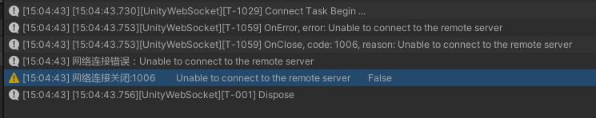
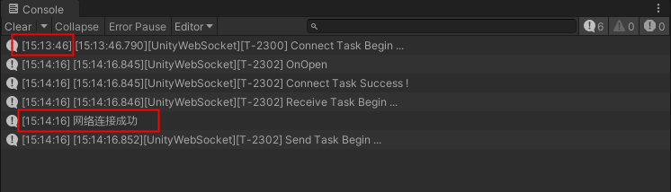
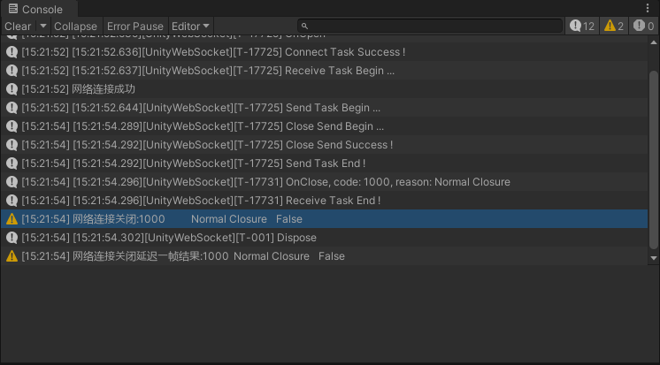
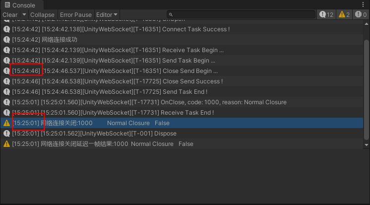
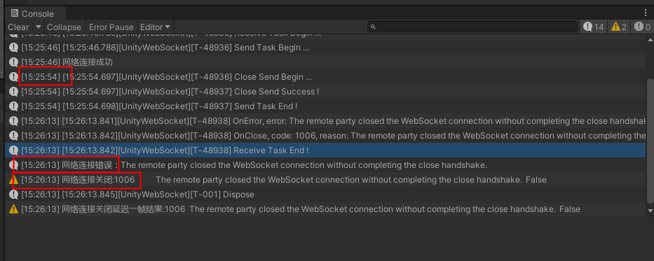

- 网络重连逻辑
  collapsed:: true
  :LOGBOOK:
  CLOCK: [2025-08-14 Thu 14:39:52]--[2025-08-14 Thu 14:39:54] =>  00:00:02
  :END:
	- 本地测试连接地址:
	  ws://192.168.196.19:7000/ws
	- 确定websocket连接在没有网络状态下进行连接会触发什么样的回调函数
		- 测试结果：
			- 在没有网络的情况下连接会触发OnError回调和OnClose回调 
			- 在有网络的情况下设置比较长的网络发送延迟时间，发送数据包延时时间为15秒，连接结果如下:
			  
	- 在成功连接后直接关闭游戏会触发WebSocket终止，触发OnError和OnClose回调具体如下:
	  
	- 在成功连接主动调用Close方法触发回调结果如下:
	  
	- 在成功连接后，设置发送数据包延迟时间为15秒，主动调用Close方法回调结果如下:
	  
	- 在成功连接后，设置为断网状态下主动调用Close方法回调结果如下
	  
- 网络连接，断开，重连逻辑
-