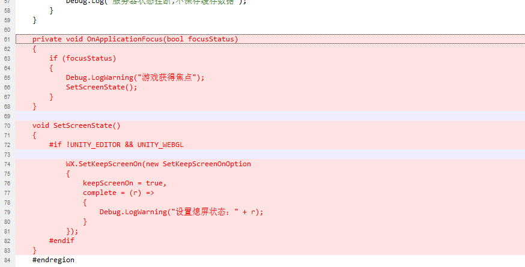

- 设置屏幕熄屏
  
- 小程序是否支持震动
- 网络重连放在OnError中进行
- 微信小程序第一次下载完成后进入游戏写入一个已经下载过资源的标识，让第二次打开不弹出下载提示
-
- 网络断开时先触发了OnError然后触发OnClose回调，小程序在连接状态下断网安卓只会触发OnClose回调
  再次连接网络时如果没有网络只会触发OnError回调
-
- 网络重连要依赖重连重试任务，不能依赖OnError，OnClose回调，因为这两个回调函数在不同的平台和不同操作系统的移动设备上表现不一致